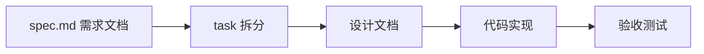

# SmartFleet - 智能车辆租赁管理平台

<p align="center">
  <strong>基于 Spring Boot 的分布式车辆租赁管理系统</strong>
</p>

---

## 🔄 开发流程

本项目采用 **SDD（Spec-Driven Development）+ TDD（Test-Driven Development）** 相结合的开发模式，通过多 Agent 协作完成小步迭代 Tasks。

## 📖 项目介绍

SmartFleet 是一个智能化的车辆租赁管理平台，旨在提供高效、可靠的车辆租赁服务。系统支持用户注册登录、车辆管理、订单处理、智能调度、实时监控等核心功能。

### 核心功能

| 模块 | 功能描述 |
|------|----------|
| **用户认证** | JWT 双 Token 认证、角色权限管理 |
| **车辆管理** | 车辆状态机、电量监控、健康检测 |
| **订单系统** | 租赁订单生命周期管理 |
| **智能调度** | 基于 GeoHash 的网格化车辆调度 |
| **动态定价** | 多场景评分策略（正常/高峰/低电量） |
| **实时监控** | WebSocket 实时数据推送 |

---

## 🛠️ 技术栈

### 后端框架

| 技术 | 版本 | 说明 |
|------|------|------|
| Spring Boot | 4.0.7 | 应用框架 |
| Spring Security | - | 安全框架 |
| MyBatis-Plus | 3.5.9 | ORM 框架 |
| SpringDoc | 2.8.6 | API 文档 (Swagger UI) |

### 中间件

| 技术 | 用途 |
|------|------|
| MySQL | 关系型数据库 |
| Redis | 缓存、分布式锁 |
| RocketMQ | 消息队列 |
| WebSocket | 实时通信 |

### 开发工具

| 技术 | 用途 |
|------|------|
| Java 17 | 编程语言 |
| Lombok | 代码简化 |
| JWT (jjwt) | Token 认证 |
| Maven | 项目构建 |

---

## 📁 项目结构

```
SmartFleet/
├── src/main/java/com/studyback/smartfleet/
│   ├── config/                    # 配置类
│   │   ├── MybatisPlusConfig.java
│   │   ├── RedisConfig.java
│   │   ├── SecurityConfig.java
│   │   ├── SwaggerConfig.java
│   │   ├── WebSocketConfig.java
│   │   ├── ScoringStrategyFactory.java
│   │   └── ScoringWeightConfig.java
│   │
│   ├── controller/                # 控制器层
│   │   ├── AuthController.java        # 认证接口
│   │   ├── UserController.java        # 用户接口
│   │   ├── VehicleController.java     # 车辆接口
│   │   ├── OrderController.java       # 订单接口
│   │   ├── PricingController.java     # 定价接口
│   │   ├── GridDispatchController.java # 调度接口
│   │   ├── MonitoringController.java  # 监控接口
│   │   └── VehicleStateController.java # 状态接口
│   │
│   ├── service/                   # 业务逻辑层
│   │   └── impl/                  # 服务实现
│   │
│   ├── mapper/                    # 数据访问层
│   ├── entity/                    # 实体类
│   ├── dto/                       # 数据传输对象
│   ├── vo/                        # 视图对象
│   ├── filter/                    # 过滤器
│   ├── exception/                 # 异常处理
│   ├── response/                  # 响应封装
│   ├── util/                      # 工具类
│   └── websocket/                 # WebSocket 处理
│
├── src/main/resources/
│   ├── application.yml            # 主配置文件
│   ├── application-local.yml      # 本地开发配置
│   ├── logback-spring.xml         # 日志配置
│   └── lua/                       # Redis Lua 脚本
│
└── pom.xml                        # Maven 配置
```

---

## 🚀 快速开始

### 环境要求

| 环境 | 版本要求 |
|------|----------|
| JDK | 17+ |
| Maven | 3.8+ |
| MySQL | 8.0+ |
| Redis | 6.0+ |
| RocketMQ | 4.9+ |

### 1. 克隆项目

```bash
git clone https://github.com/your-username/SmartFleet.git
cd SmartFleet
```

### 2. 配置数据库

创建数据库并初始化：

```sql
CREATE DATABASE smartfleet DEFAULT CHARACTER SET utf8mb4 COLLATE utf8mb4_unicode_ci;
```

### 3. 修改配置

编辑 `src/main/resources/application-local.yml`：

```yaml
spring:
  datasource:
    username: your_username
    password: your_password

  data:
    redis:
      host: localhost
      port: 6379
      password: your_redis_password

rocketmq:
  name-server: localhost:9876
```

### 4. 启动服务

```bash
# 编译项目
mvn clean package -DskipTests

# 运行应用
java -jar target/SmartFleet-0.0.1-SNAPSHOT.jar
```

或者在 IDE 中直接运行 `SmartFleetApplication.java`。

### 5. 访问应用

| 服务 | 地址 |
|------|------|
| 应用主页 | http://localhost:8080 |
| Swagger UI | http://localhost:8080/swagger-ui.html |
| API 文档 | http://localhost:8080/v3/api-docs |

---

## ⚙️ 配置说明

### JWT 配置

```yaml
jwt:
  secret: ${JWT_SECRET:your-base64-secret}  # 生产环境必须设置环境变量
  access-token-expiration: 1800000          # 访问 Token 30 分钟
  refresh-token-expiration: 604800000       # 刷新 Token 7 天
```

### 评分权重配置

系统支持三种场景的车辆评分策略：

```yaml
scoring:
  weights:
    normal:        # 正常场景
      distance: 0.4
      battery: 0.25
      idle-time: 0.15
      health: 0.2
    peak-hour:     # 高峰场景
      distance: 0.2
      battery: 0.45
      idle-time: 0.1
      health: 0.25
    low-battery:   # 低电量场景
      distance: 0.15
      battery: 0.15
      idle-time: 0.45
      health: 0.25
```

---

## 📚 API 接口

启动应用后，访问 Swagger UI 查看完整 API 文档：

```
http://localhost:8080/swagger-ui.html
```

### 主要接口模块

- `/api/auth/*` - 认证相关（登录、注册、刷新 Token）
- `/api/users/*` - 用户管理
- `/api/vehicles/*` - 车辆管理
- `/api/orders/*` - 订单管理
- `/api/pricing/*` - 定价查询
- `/api/dispatch/*` - 调度管理
- `/api/monitoring/*` - 监控数据

---

## 🧪 测试

```bash
# 运行所有测试
mvn test

# 运行特定测试类
mvn test -Dtest=SmartFleetApplicationTests
```

---

### 开发理念

```
┌─────────────────────────────────────────────────────────────────┐
│                    SDD + TDD 开发闭环                            │
├─────────────────────────────────────────────────────────────────┤
│                                                                 │
│   ┌──────────┐    ┌──────────┐    ┌──────────┐    ┌──────────┐ │
│   │  Spec    │───▶│  Task    │───▶│  Code    │───▶│  Test    │ │
│   │  驱动    │    │  拆分    │    │  实现    │    │  验证    │ │
│   └──────────┘    └──────────┘    └──────────┘    └──────────┘ │
│        ▲                                              │        │
│        └──────────────────────────────────────────────┘        │
│                        持续反馈迭代                              │
└─────────────────────────────────────────────────────────────────┘
```

### 多 Agent 协作架构

```
┌─────────────────────────────────────────────────────────────────┐
│                      Coordinator (主 Agent)                      │
│                    ┌───────────────────────┐                     │
│                    │  • 读取状态            │                     │
│                    │  • 分发任务            │                     │
│                    │  • 审查结果            │                     │
│                    │  • 执行门禁            │                     │
│                    └───────────┬───────────┘                     │
│                                │                                 │
│              ┌─────────────────┼─────────────────┐               │
│              ▼                                   ▼               │
│   ┌─────────────────────┐           ┌─────────────────────┐     │
│   │    backed Agent     │           │    review Agent     │     │
│   │  ┌───────────────┐  │           │  ┌───────────────┐  │     │
│   │  │ • 编写代码     │  │           │  │ • 代码审查     │  │     │
│   │  │ • 编译验证     │  │           │  │ • 编写测试     │  │     │
│   │  │ • 生成变更契约 │  │           │  │ • 执行测试     │  │     │
│   │  └───────────────┘  │           │  │ • 生成报告     │  │     │
│   │                     │           │  └───────────────┘  │     │
│   │  🔧 Worktree 隔离   │           │  🔍 Worktree 隔离   │     │
│   └─────────────────────┘           └─────────────────────┘     │
└─────────────────────────────────────────────────────────────────┘
```

### 里程碑与 7 步开发流程

项目按 **7 个里程碑** 迭代开发，每个里程碑遵循统一的 **7 步流程**：

| 里程碑 | 模块 | 核心内容 |
|--------|------|----------|
| M1 | 基础设施 | Spring Boot 骨架、MySQL/Redis/RocketMQ 配置 |
| M2 | 用户认证 | Spring Security + JWT、角色权限 |
| M3 | 车辆调度 | 多维评分引擎、策略模式 |
| M4 | 租赁一致性 | Redis 预占锁、乐观锁、自旋重试 |
| M5 | 状态机 | 车辆生命周期状态管理 |
| M6 | 运力定价 | GeoHash 网格化、动态定价 |
| M7 | 实时监控 | Cache Aside、RocketMQ、WebSocket |

#### 每个里程碑的 7 步流程

```
Step 1: 工程准备          Step 2: 测试先行           Step 3: 硬编码跑通
┌─────────────────┐      ┌─────────────────┐      ┌─────────────────┐
│ • 初始化项目结构 │      │ • 编写测试用例   │      │ • 快速验证核心   │
│ • 添加 Maven 依赖│ ───▶ │ • 定义验收标准   │ ───▶ │   逻辑可行性    │
│ • 配置目录结构   │      │ • 覆盖边界条件   │      │ • 硬编码验证     │
└─────────────────┘      └─────────────────┘      └─────────────────┘
                                                          │
Step 7: 集成测试          Step 6: 检索实现           Step 4: 骨架搭建
┌─────────────────┐      ┌─────────────────┐      ┌─────────────────┐
│ • 端到端测试     │      │ • 实现查询接口   │      │ • 创建 Entity    │
│ • 集成验证       │ ◀─── │ • 分页与排序     │ ◀─── │ • 创建 Mapper    │
│ • 性能基准       │      │ • 条件过滤       │      │ • Service/Controller│
└─────────────────┘      └─────────────────┘      └─────────────────┘
                                │
                                ▼
                        Step 5: 数据加载
                        ┌─────────────────┐
                        │ • 数据持久化     │
                        │ • 缓存封装       │
                        │ • MQ 工具类      │
                        └─────────────────┘
```

### 工作流程详解

#### 1️⃣ Spec 驱动（SDD）



- **需求来源**：`docs/spec.md` 定义了完整的业务场景和边界条件
- **任务拆分**：每个里程碑拆分为多个小步 Tasks（`docs/tasks/task{N}-*.md`）
- **设计先行**：每个 Task 有明确的输入/输出定义和接口规范

#### 2️⃣ 测试驱动（TDD）

```
┌────────────────────────────────────────────────────────────┐
│                     TDD 开发循环                            │
├────────────────────────────────────────────────────────────┤
│                                                            │
│    ┌─────────┐    ┌─────────┐    ┌─────────┐              │
│    │  RED    │───▶│ GREEN   │───▶│ REFACTOR│              │
│    │ 写测试  │    │ 写实现  │    │ 重构    │              │
│    │ (失败)  │    │ (通过)  │    │ (优化)  │              │
│    └─────────┘    └─────────┘    └─────────┘              │
│         ▲                              │                   │
│         └──────────────────────────────┘                   │
│                                                            │
│    测试用例来源：                                           │
│    • docs/test-record.md（测试用例模板）                    │
│    • docs/spec.md（边界条件表）                             │
│    • review Agent 自动生成                                 │
└────────────────────────────────────────────────────────────┘
```

#### 3️⃣ 多 Agent 协作流程

```
用户: "开始 M3"
       │
       ▼
┌──────────────────────────────────────────────────────────────┐
│                    Coordinator (主 Agent)                      │
├──────────────────────────────────────────────────────────────┤
│ 1. 读取 .claude/state.json 获取当前进度                       │
│ 2. 读取 docs/tasks/task3-m3-vehicle-scheduling.md            │
│ 3. 更新状态: current_stage = "BACKED_DEVELOP"                │
│ 4. 调用 backed Agent ─────────────────────────────────┐      │
│                                                        │      │
│ 5. 等待完成，审查 changes-m3-task3.json ◄──────────────┘      │
│ 6. 更新状态: current_stage = "GATE_CHECK"                     │
│ 7. 调用 review Agent ─────────────────────────────────┐      │
│                                                        │      │
│ 8. 解析 gate-report-m3-round1.json ◄──────────────────┘      │
│ 9. 门禁决策:                                                  │
│    • compile_status = FAILED → 打回 backed                   │
│    • unit_test_status = FAILED → 打回 review                 │
│    • blocker_count > 0 → 打回 backed                         │
│ 10. 门禁通过 → 通知用户                                       │
└──────────────────────────────────────────────────────────────┘
```

### 契约化交付产物

每个阶段产出结构化的 JSON 契约，确保 Agent 间协作清晰：

| 产物 | 路径 | 说明 |
|------|------|------|
| 变更契约 | `docs/changes/changes-m{N}-task{N}.json` | backed Agent 输出，记录代码变更 |
| 审查报告 | `docs/review/review-m{N}-round{N}.json` | review Agent 输出，5 维度审查结果 |
| 门禁报告 | `docs/test/gate-report-m{N}-round{N}.json` | 测试结果、覆盖率、失败详情 |

#### 变更契约示例

```json
{
  "taskId": "task3",
  "task_name": "实现多维评分引擎",
  "modified_files": ["src/.../ScoringService.java"],
  "new_files": ["src/.../NormalScoringStrategy.java"],
  "exposed_apis": [
    { "method": "GET", "path": "/api/vehicles/recommend", "desc": "车辆推荐" }
  ],
  "compile_status": "SUCCESS"
}
```

#### 门禁报告示例

```json
{
  "milestone": "M3",
  "compile_status": "SUCCESS",
  "unit_test_status": "PASSED",
  "total_tests": 85,
  "passed": 85,
  "failed": 0,
  "pass_rate": "100.0%",
  "line_coverage": "82.5%"
}
```

### 审查维度（5 维度）

review Agent 从以下 5 个维度进行代码审查：

| 维度 | 严重级别 | 检查内容 |
|------|----------|----------|
| ✅ 正确性 | BLOCKER | 接口与设计文档一致、状态机转移正确 |
| 📝 代码质量 | MAJOR | 命名规范、方法长度、SOLID 原则 |
| ⚠️ 异常处理 | BLOCKER | 外部依赖 try-catch、BusinessException 包装 |
| 🔒 安全性 | BLOCKER | SQL 注入、敏感信息泄露、权限控制 |
| ⚡ 性能 | MAJOR | N+1 查询、缓存使用、序列化问题 |

### 里程碑状态追踪

项目通过 `.claude/state.json` 实时追踪开发进度：

```
M1 基础设施搭建  [✅] CODE  [✅] REVIEW  [✅] TEST  [✅] GATE
M2 用户认证安全  [✅] CODE  [✅] REVIEW  [✅] TEST  [✅] GATE
M3 车辆调度引擎  [✅] CODE  [✅] REVIEW  [✅] TEST  [✅] GATE
M4 高并发租赁    [✅] CODE  [✅] REVIEW  [✅] TEST  [✅] GATE
M5 车辆状态机    [✅] CODE  [✅] REVIEW  [✅] TEST  [✅] GATE
M6 区域运力调度  [✅] CODE  [✅] REVIEW  [✅] TEST  [✅] GATE
M7 实时监控      [✅] CODE  [✅] REVIEW  [✅] TEST  [✅] GATE
```

---

## 📝 开发规范

### 代码规范

- 使用 Lombok 简化 POJO 代码
- 遵循 RESTful API 设计规范
- 统一使用 `ApiResponse<T>` 封装返回结果
- 异常统一由 `GlobalExceptionHandler` 处理
- 遵循 Google Java Style，最大行宽 120 字符
- 关键业务逻辑必须注释，getter/setter 无需注释

### 分支管理

- `main` - 主分支，稳定版本
- `develop` - 开发分支
- `feature/*` - 功能分支
- `hotfix/*` - 紧急修复分支

### Agent 隔离策略

| Agent | 隔离模式 | 命名规则 |
|-------|----------|----------|
| backed | Git Worktree | `backed-m{N}-task{N}` |
| review | Git Worktree | `review-m{N}-round{N}` |

每个 Agent 在独立的 Worktree 中工作，确保代码变更互不干扰，通过契约化 JSON 进行协作。

---

## 📄 许可证

本项目仅用于学习目的。

---

<p align="center">
  Made with ❤️ by SmartFleet Team
</p>
