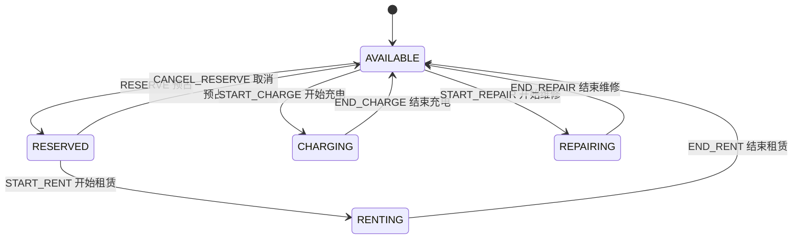
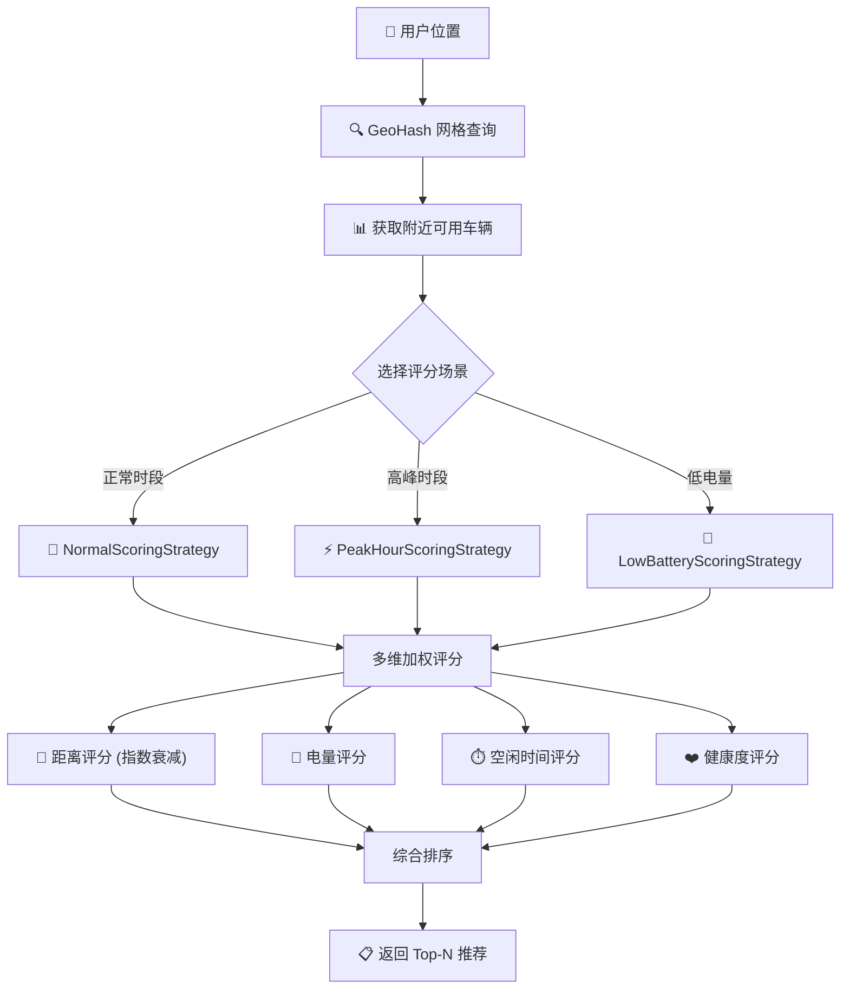
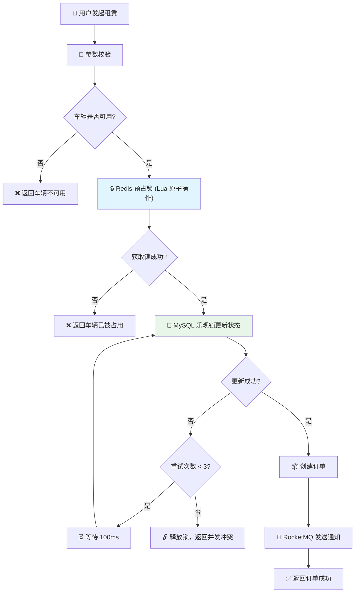
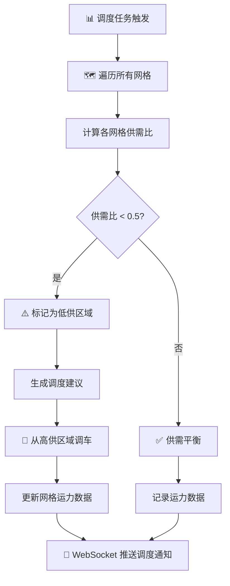
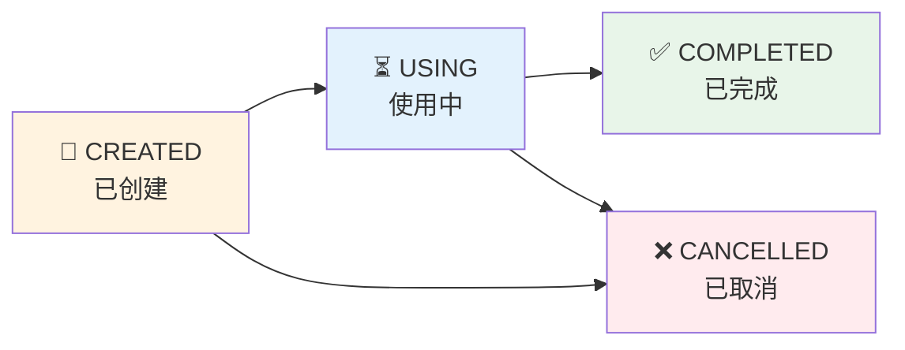

# SmartFleet - 智能车辆租赁管理平台

## 项目简介

本系统是一个基于 **Spring Boot 3.4 + MyBatis-Plus** 构建的智能车辆租赁管理平台。系统集成了多维评分引擎、GeoHash 网格化调度、状态机管理、高并发租赁一致性控制、实时监控等能力，为用户提供高效、可靠的智能租车服务。

### 核心功能

| 模块 | 说明 |
|------|------|
| **用户认证** | JWT 双 Token 认证（Access + Refresh）、Spring Security 角色权限管理（USER/ADMIN） |
| **车辆状态机** | 5 种状态（空闲/已预占/租赁中/充电中/维修中）、8 种事件驱动的状态转移，防止非法状态变更 |
| **多维评分引擎** | 策略模式实现三种场景评分（正常/高峰/低电量），指数衰减距离评分，加权综合排序 |
| **智能车辆推荐** | 基于用户位置的附近车辆推荐，支持 GeoHash 空间索引加速查询 |
| **高并发租赁** | Redis 预占锁（Lua 脚本原子操作）+ MySQL 乐观锁 + 自旋重试，保证租赁一致性 |
| **GeoHash 网格调度** | 基于 GeoHash 的区域运力分析，供需比计算，低供区域自动调度建议 |
| **动态定价** | 多场景定价策略，根据时段、区域运力、电量等因素动态调整租赁价格 |
| **实时监控** | WebSocket 实时推送车辆状态、订单变更、调度信息，Redis 缓存热点数据 |
| **消息队列** | RocketMQ 异步处理订单状态变更通知，解耦业务模块 |

### 技术栈

| 类别 | 技术 |
|------|------|
| 框架 | Spring Boot 3.4.7、Java 17 |
| ORM | MyBatis-Plus 3.5.9 |
| 数据库 | MySQL 8.0+ |
| 缓存 | Redis（分布式锁、会话缓、热点数据） |
| 消息队列 | RocketMQ 2.2.3 |
| API 文档 | SpringDoc OpenAPI 2.8.6（Swagger UI） |
| 认证 | JWT（jjwt 0.12.6）+ Spring Security |
| 实时通信 | WebSocket |
| 工具 | Lombok、Maven |

---

## 核心流程图

### 车辆状态机



### 车辆推荐评分流程



### 高并发租赁流程



### GeoHash 网格调度流程



### 订单生命周期



---

## 项目结构

```
src/main/java/com/studyback/smartfleet/
├── SmartFleetApplication.java                    # 启动类
│
├── config/                                        # ── 全局配置 ──
│   ├── MybatisPlusConfig.java                     #   MyBatis-Plus 分页插件配置
│   ├── RedisConfig.java                           #   Redis 序列化配置（JSON）
│   ├── SecurityConfig.java                        #   Spring Security 安全配置
│   ├── SwaggerConfig.java                         #   SpringDoc OpenAPI 配置
│   ├── WebSocketConfig.java                       #   WebSocket 端点配置
│   ├── ScoringStrategyFactory.java                #   评分策略工厂（策略模式）
│   └── ScoringWeightConfig.java                   #   评分权重配置（YAML 绑定）
│
├── controller/                                    # ── 控制器层 ──
│   ├── AuthController.java                        #   认证接口（登录/注册/刷新Token）
│   ├── UserController.java                        #   用户管理接口
│   ├── VehicleController.java                     #   车辆管理接口
│   ├── VehicleStateController.java                #   车辆状态机接口
│   ├── VehicleRecommendController.java            #   车辆推荐接口
│   ├── OrderController.java                       #   订单管理接口
│   ├── PricingController.java                     #   动态定价接口
│   ├── GridDispatchController.java                #   网格调度接口
│   └── MonitoringController.java                  #   实时监控接口
│
├── entity/                                        # ── 数据库实体 ──
│   ├── User.java                                  #   用户实体
│   ├── Vehicle.java                               #   车辆实体
│   ├── Order.java                                 #   订单实体
│   ├── PricingRule.java                           #   定价规则实体
│   ├── GridDispatch.java                          #   网格运力实体
│   ├── DispatchSuggestion.java                    #   调度建议实体
│   ├── StateChangeRecord.java                     #   状态变更记录
│   ├── VehicleRecommendation.java                 #   车辆推荐结果
│   │
│   ├── VehicleStatus.java                         #   车辆状态枚举（5种状态）
│   ├── StateEvent.java                            #   状态事件枚举（8种事件）
│   ├── OrderStatus.java                           #   订单状态枚举
│   ├── RoleEnum.java                              #   角色枚举（USER/ADMIN）
│   │
│   ├── VehicleStateMachine.java                   #   状态机接口
│   ├── VehicleStateMachineImpl.java               #   状态机实现
│   ├── StateTransition.java                       #   状态转移定义
│   ├── StateTransitionValidator.java              #   状态转移校验器
│   │
│   ├── ScoringStrategy.java                       #   评分策略接口
│   ├── AbstractScoringStrategy.java               #   评分策略抽象类
│   ├── NormalScoringStrategy.java                 #   正常场景评分策略
│   ├── PeakHourScoringStrategy.java               #   高峰场景评分策略
│   ├── LowBatteryScoringStrategy.java             #   低电量场景评分策略
│   ├── ScoringDimension.java                      #   评分维度枚举
│   ├── ScoringScene.java                          #   评分场景枚举
│   ├── ScoringResult.java                         #   评分结果
│   └── GeoHashPoint.java                          #   GeoHash 坐标点
│
├── service/                                       # ── 业务服务层 ──
│   ├── AuthService.java                           #   认证服务
│   ├── UserService.java                           #   用户服务
│   ├── VehicleService.java                        #   车辆服务
│   ├── VehicleStateService.java                   #   车辆状态机服务
│   ├── VehicleScoringService.java                 #   车辆评分服务
│   ├── OrderService.java                          #   订单服务
│   ├── DynamicPricingService.java                 #   动态定价服务
│   ├── GeoHashService.java                        #   GeoHash 服务
│   ├── GridDispatchService.java                   #   网格调度服务
│   ├── CapacityDispatchService.java               #   运力调度服务
│   ├── MonitoringService.java                     #   监控服务
│   ├── RedisLockService.java                      #   Redis 分布式锁服务
│   ├── CacheAsideService.java                     #   Cache Aside 缓存服务
│   ├── RetryService.java                          #   重试服务
│   ├── RocketMQProducerService.java               #   MQ 生产者服务
│   ├── RocketMQConsumerService.java               #   MQ 消费者服务
│   ├── WebSocketService.java                      #   WebSocket 推送服务
│   │
│   └── impl/                                      #   服务实现类（共 16 个）
│
├── mapper/                                        # ── MyBatis-Plus Mapper ──
│   ├── UserMapper.java
│   ├── VehicleMapper.java
│   ├── OrderMapper.java
│   ├── PricingRuleMapper.java
│   ├── GridDispatchMapper.java
│   ├── DispatchSuggestionMapper.java
│   └── StateChangeRecordMapper.java
│
├── dto/                                           # ── 数据传输对象 ──
│   ├── LoginDTO.java                              #   登录请求
│   ├── RefreshTokenDTO.java                       #   Token 刷新请求
│   └── UserDTO.java                               #   用户注册请求
│
├── vo/                                            # ── 视图对象 ──
│   ├── UserVO.java                                #   用户响应
│   ├── TokenVO.java                               #   Token 响应
│   └── MonitoringData.java                        #   监控数据
│
├── response/                                      # ── 响应封装 ──
│   ├── ApiResponse.java                           #   统一响应封装
│   └── ResultCode.java                            #   响应码枚举
│
├── exception/                                     # ── 异常处理 ──
│   ├── BusinessException.java                     #   业务异常
│   └── GlobalExceptionHandler.java                #   全局异常处理器
│
├── filter/                                        # ── 过滤器 ──
│   ├── JwtAuthenticationFilter.java               #   JWT 认证过滤器
│   └── TraceIdFilter.java                         #   链路追踪 ID 过滤器
│
├── util/                                          # ── 工具类 ──
│   ├── JwtUtil.java                               #   JWT 工具类
│   ├── RedisUtil.java                             #   Redis 工具类
│   └── RocketMQUtil.java                          #   RocketMQ 工具类
│
└── websocket/                                     # ── WebSocket ──
    └── MonitoringWebSocketHandler.java            #   监控 WebSocket 处理器
```

---

## 快速开始

### 环境要求

- JDK 17+
- MySQL 8.0+
- Redis 6.0+
- RocketMQ 4.9+
- Maven 3.8+

### 1. 配置数据库

创建数据库并导入初始数据：

```sql
CREATE DATABASE smartfleet DEFAULT CHARACTER SET utf8mb4 COLLATE utf8mb4_unicode_ci;
USE smartfleet;
SOURCE docs/sql/schema.sql;
SOURCE docs/sql/data.sql;
```

### 2. 启动中间件

确保以下服务已启动：

| 服务 | 默认地址 | 说明 |
|------|----------|------|
| MySQL |  | 数据库 |
| Redis | | 缓存 |
| RocketMQ NameServer | | 消息队列 |

### 3. 修改配置

编辑 `src/main/resources/application-local.yml`：

```yaml
spring:
  datasource:
    username: your_username
    password: your_password

  data:
    redis:
      host: localhost
      port: 6379
      password: your_redis_password

rocketmq:
  name-server: 
```

### 4. 启动项目

```bash
# 方式一：Maven 启动
mvn spring-boot:run

# 方式二：打包后运行
mvn clean package -DskipTests
java -jar target/SmartFleet-0.0.1-SNAPSHOT.jar
```

或者在 IDE 中直接运行 `SmartFleetApplication.java`。

---

## ⚙️ 配置说明

### JWT 配置

```yaml
jwt:
  secret: ${JWT_SECRET:your-base64-secret}  # 生产环境必须设置环境变量
  access-token-expiration: 1800000          # 访问 Token 30 分钟
  refresh-token-expiration: 604800000       # 刷新 Token 7 天
```

### 评分权重配置

系统支持三种场景的车辆评分策略：

```yaml
scoring:
  weights:
    normal:        # 正常场景
      distance: 0.4
      battery: 0.25
      idle-time: 0.15
      health: 0.2
    peak-hour:     # 高峰场景
      distance: 0.2
      battery: 0.45
      idle-time: 0.1
      health: 0.25
    low-battery:   # 低电量场景
      distance: 0.15
      battery: 0.15
      idle-time: 0.45
      health: 0.25
```

---

### 主要接口模块

| 模块 | 路径 | 说明 |
|------|------|------|
| 认证 | `/api/auth/*` | 登录、注册、刷新 Token |
| 用户 | `/api/users/*` | 用户管理 |
| 车辆 | `/api/vehicles/*` | 车辆管理、状态变更 |
| 推荐 | `/api/vehicles/recommend` | 基于位置的车辆推荐 |
| 订单 | `/api/orders/*` | 订单创建、查询、完成 |
| 定价 | `/api/pricing/*` | 动态定价查询 |
| 调度 | `/api/dispatch/*` | 网格运力、调度建议 |
| 监控 | `/api/monitoring/*` | 实时监控数据 |
| 状态 | `/api/vehicles/state/*` | 状态机操作 |

---

## 核心设计

### 1. 状态机模式

车辆状态转移采用状态机模式，防止非法状态变更：

```java
// 状态转移定义
AVAILABLE + RESERVE       → RESERVED
RESERVED + CANCEL_RESERVE → AVAILABLE
RESERVED + START_RENT     → RENTING
RENTING + END_RENT        → AVAILABLE
AVAILABLE + START_CHARGE  → CHARGING
CHARGING + END_CHARGE     → AVAILABLE
AVAILABLE + START_REPAIR  → REPAIRING
REPAIRING + END_REPAIR    → AVAILABLE
```

### 2. 策略模式 - 评分引擎

```java
// 评分策略接口
public interface ScoringStrategy {
    double calculateScore(Vehicle vehicle, double distance, ScoringScene scene);
}

// 三种实现
NormalScoringStrategy     // 正常场景：距离权重最高
PeakHourScoringStrategy   // 高峰场景：电量权重最高
LowBatteryScoringStrategy // 低电量场景：空闲时间权重最高
```

### 3. 高并发一致性

```
┌─────────────────────────────────────────────────────────┐
│                租赁一致性三重保障                         │
├─────────────────────────────────────────────────────────┤
│                                                         │
│  1. Redis 预占锁（Lua 脚本原子操作）                      │
│     └── 防止并发请求同时操作同一车辆                       │
│                                                         │
│  2. MySQL 乐观锁（version 字段）                         │
│     └── 数据库层面保证数据一致性                           │
│                                                         │
│  3. 自旋重试（最多 3 次，间隔 100ms）                     │
│     └── 处理短暂冲突，提高成功率                           │
│                                                         │
└─────────────────────────────────────────────────────────┘
```

### 4. Cache Aside 模式

```java
// 读操作：先查缓存，miss 则查库并写缓存
Object value = redisUtil.get(key);
if (value == null) {
    value = db.query(...);
    redisUtil.set(key, value, ttl);
}

// 写操作：先更新数据库，再删除缓存
db.update(...);
redisUtil.delete(key);
```

---

## 📝 开发规范

### 代码规范

- 使用 Lombok 简化 POJO 代码
- 遵循 RESTful API 设计规范
- 统一使用 `ApiResponse<T>` 封装返回结果
- 异常统一由 `GlobalExceptionHandler` 处理
- 遵循 Google Java Style，最大行宽 120 字符
- 关键业务逻辑必须注释，getter/setter 无需注释


<p align="center">
  Made with ❤️ by SmartFleet Team
</p>
